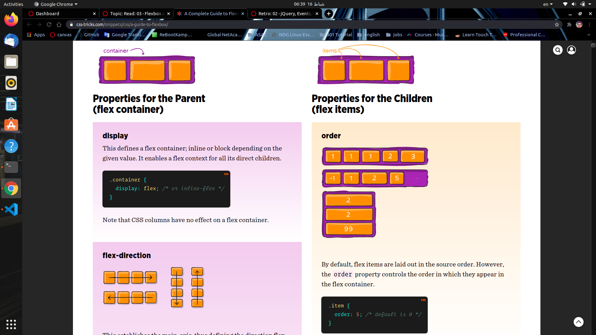
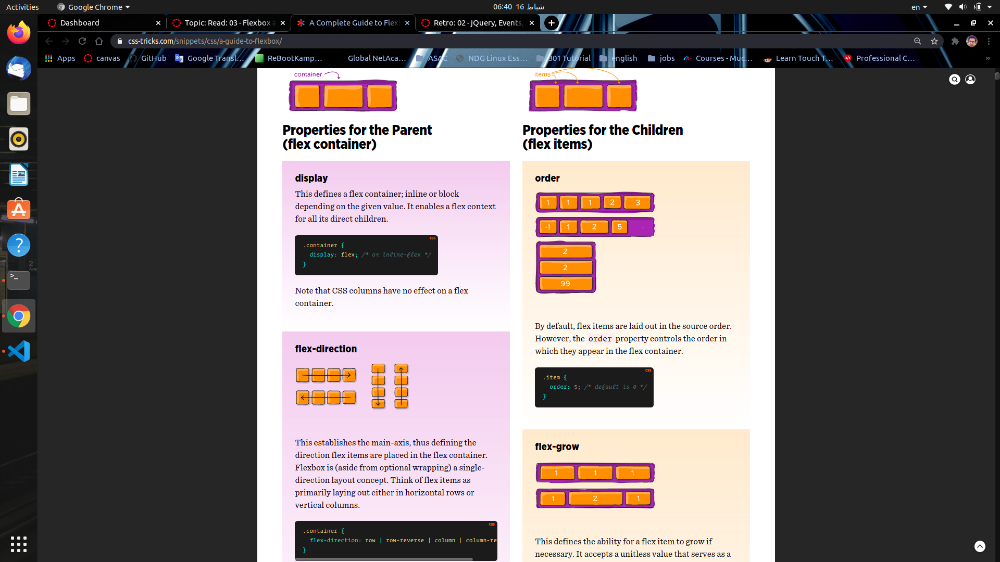
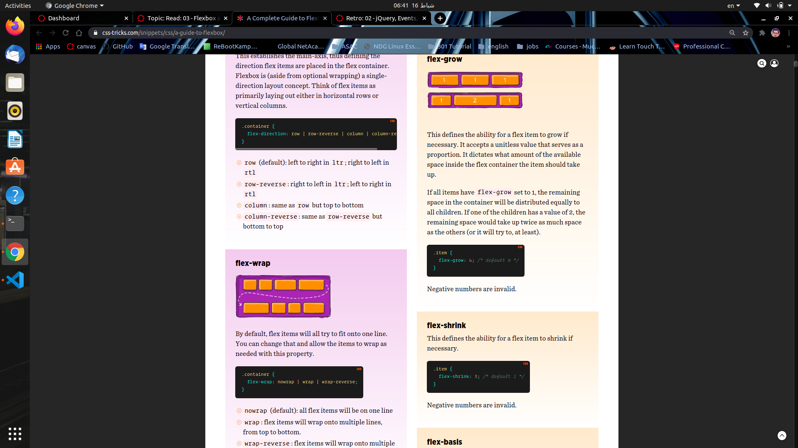
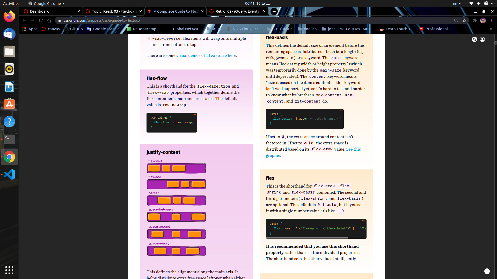

# MUSTACHE and FLEXBOX

## *Javascript Templating*
**Javascript templating is a fast and efficient technique to render client-side view templates with Javascript by using a JSON data source.**

## *Mustache*
**Is a logic-less template syntax. It can be used for HTML, config files, source code — anything. It works by expanding tags in a template using values provided in a hash or object.**

## *mustache.js*
**Is an implementation of the mustache template system in JavaScript. It is often considered the base for JavaScript templating. And, since mustache supports various languages, we don’t need a separate templating system on the server side.**

## Flexbox we have to many type for flexbox as we can see in the pictures below :

