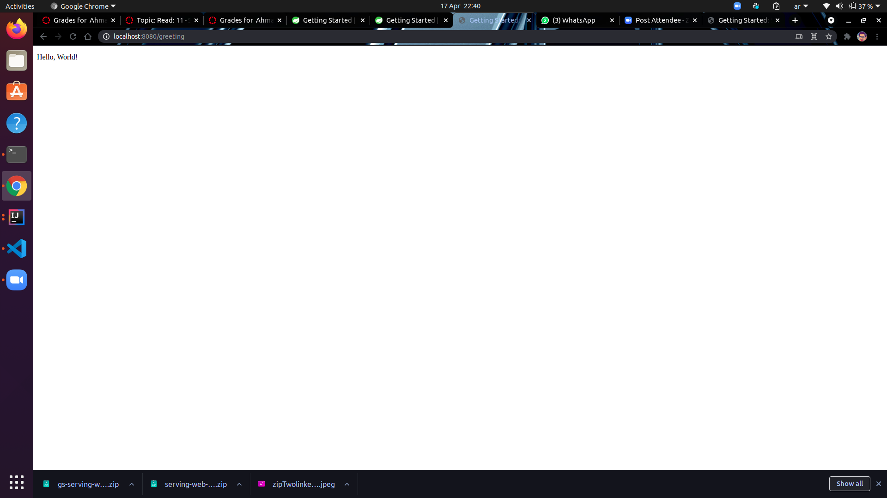
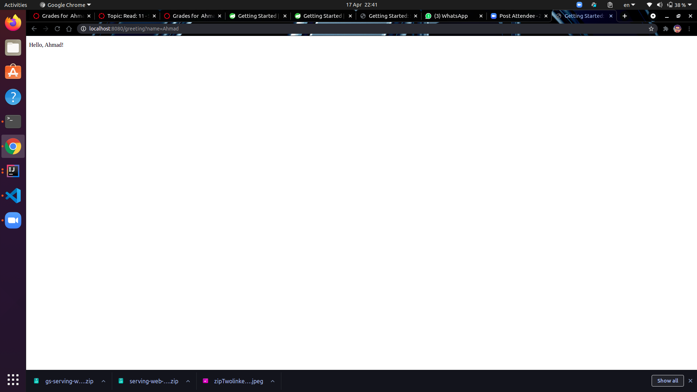

# 1.Spring

 ## A)  Serving Web Content with Spring MVC

### We will build a page printing "Hello world" using Spring to complete this we will do the following :

* #### first we need to Create a Web Controller this will control the path that are we send and when we hit this t path will show specific information.

* #### And we need to create HTML page to show our data on it.

##  B) Run the Application

 * #### to run our application we need to call the method in the main and use the  `./gradlew bootRun` command if we want to see the out put in the browser  in http://localhost:8080.

> #### Here is example for the output:

* #### in the http://localhost:8080/grating

* #### in the http://localhost:8080/greeting?name=Ahmad

# 2.Spring MVC and Thymeleaf: how to access data from templates.

### A) Spring model attributes :

#### To call data in spring there is severl way to do that using  model attributes.

* ##### "Add attribute to Model via its addAttribute method".

* ##### "Return ModelAndView with model attributes included".

* ##### "Expose common attributes via methods annotated with @ModelAttribute".

### B ) Request parameter: 

#### The request param we can send it the url  in the query param.

### C ) Session attributes.

#### To use it we need to add  session.setAttribute in our code and set the atttibutes that we need to use.

### D )  ServletContext attributes:

#### "The ServletContext attributes are shared between requests and sessions. In order to access ServletContext attributes in Thymeleaf you can use the #servletContext."