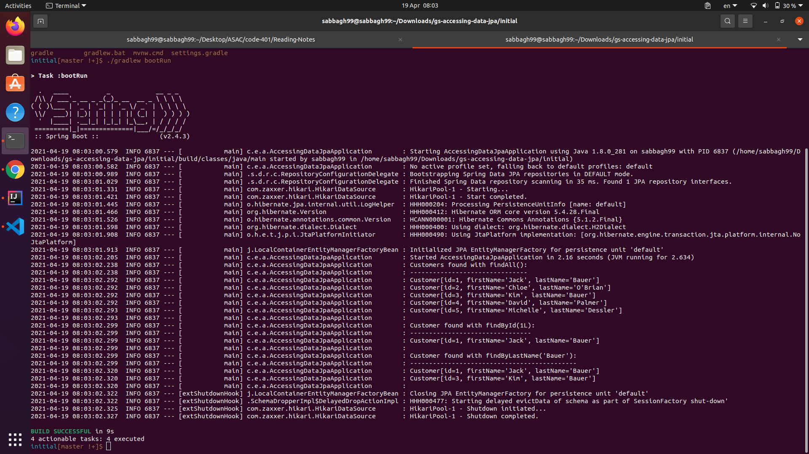

# Spring RESTful Routing & Static Files.

## A )  Spring RequestMapping: 

### 1.  @RequestMapping Basics

#### If we want to use  RequestMapping there is some  criteria should to know them.

* ####  @RequestMapping — by Path : here we need to add the path that we will use and provde it with the  request method that we will use and with the body  after we hit this path.

* ####  @RequestMapping — the HTTP Method: for the HTTP Method  there is no default parameter so if we didn't specifiy a value in the it's will map to any HTTP request. 

* #### RequestMapping and HTTP Headers:

    * #####  @RequestMapping With the headers Attribute: to use header attribute  we need to add in the request as `headers = "key=val"`, we can pass multiple headers in the one request 

    * #####  @RequestMapping Consumes and Produces.

## B) Accessing Data with JPA : 

### In this part we will build an application that stores Customer POJOs (Plain Old Java Objects) in a memory-based database.

### In this [website](https://spring.io/guides/gs/accessing-data-jpa/) we have all detals to do that.

### and our output should be like this :
.

