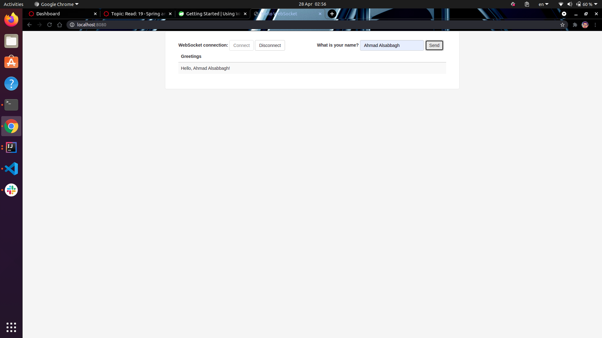

# Real time messaging with websockets.

## Using WebSocket to build an interactive web application

### In tihs read we will build a server that accepts a message that carries a user’s name. In response, the server will push a greeting into a queue to which the client is subscribed.

### what we did in this reed is how to build application that response for you when you send your name will respond for you with a greeting massage.